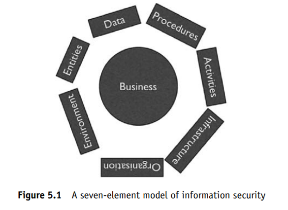

# Previewing

    The preview process may be considered to carry a significant risk of violating the ACPO’s first principle, because it requires direct examination of the suspect devices.

## Offline preview

    In a typical preview situation, the device to be previewed will be dealt with in an offline state.

    i.e, it will have been disconnected from networks and shut down to allow the examiner to remove storage devices for connection to a trusted preview workstation.

    Ideally, devices will be connected through a write-blocking device to ensure that ACPO Principle 1 is still upheld.

    it is possible to use a common USB write-blocker to protect them against accidental digital contamination.

## Online Preview

    The major disadvantage of offline preview is the requirement to shut down the device under examination and gain physical access to the storage devices it contains.

    The preview examination will be carried out on a live system, which is undergoing changes of state and which cannot be considered to be completely trustworthy.

    Programs such as rootkits, which are designed to implant themselves into a system to allow an attacker to abuse that system
    In order to conduct an online preview, most examiners have access to trusted tools on read-only media such as CDs.

    These tools have been written in a trusted environment and the CD contains all the code necessary to allow them to run without using any code from the suspect system

    They tend, also, to be written in such a way that they protect the suspect system from accidental changes to data, apart from the necessary changes to primary RAM to run the trusted tools themselves

# Continuity and hashing

    At the highest level, one or more hash values will be computed for the data on the original device.

    Because the image has been produced from this device, and contains identical data, the hash value for the image should match, exactly.

    Original Hashing algorithms such as MD5, SHA-1 and SNEFRU are very sensitive to changes in data, and the modification of even a single bit

# Imaging

    To produce an accurate copy of a digital storage device, we need to use a method which will produce a complete copy of the device, including all unused space, deleted data and, if possible, damaged areas.

## Offline Imaging

    In this process, the suspect device is connected to an imaging workstation using a write-blocker.

    The imaging software is then used to read data from the device and store it to either a file or separate device.

    Once imaging is complete, the first copy is usually considered to be the master copy and further working copies can be generated as required

## Online Imaging

    The storage device is left in situ and live imaging tools are used to capture data from it using the accompanying hardware.

    Of course, this poses similar problems to online previewing, but the use of trusted tools goes some way to mitigating these.

    The trusted tools allow the examiner to copy the device to either an external storage device, such as a USB hard disc, or across a network to a dedicated storage server

# Seven Element Security Model

    It contains seven key elements which are inter-linked to compose the system as a whole.

    Each of these elements must be secure in its own right and depends on its neighboring elements to ensure this.

    If there is a weakness in any one of the elements, the whole system is insecure and may be attacked/abused through the weak element(s).
